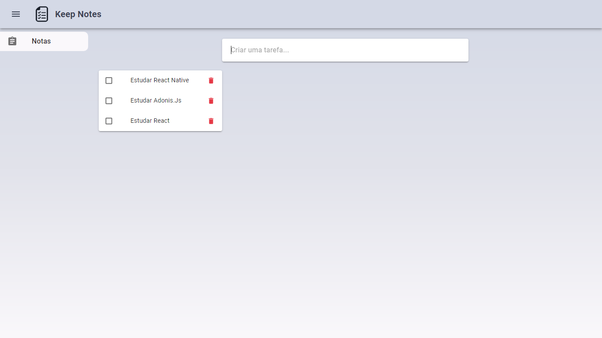

<p align="center">
   
</p>

<h1 align="center">Keep Notes API</h1>

| Api rest que permitirá gerenciar suas tarefas.

<p align="center">
  
</p>

## :link: Para testar [clique aqui.](https://jeffeloy-keepnotes.netlify.app/)

## :bulb: Objetivo

| Desenvolver uma api rest, que permita ao usuário adicionar,listar e deletar suas tarefas. E conectá-la ao front end web desta aplicação.

## :black_nib: Justificativa

| Essa aplicação faz parte do meu portifólio, e foi desenvolvida com o intuito de adquirir ainda mais conhecimentos na stack JavaScript.

## 👨🏼‍💻 Autores

| Foto                                                                                                                             | Nome                      | GitHub                                   | Likedin                                                 | E-mail                    |
| -------------------------------------------------------------------------------------------------------------------------------- | ------------------------- | ---------------------------------------- | ------------------------------------------------------- | ------------------------- |
|  | Jefferson de Santana Eloy | [Jefferson](https://github.com/jeffeloy) | [Linkedin](https://www.linkedin.com/in/jefferson-eloy/) | contatojeloydev@gmail.com |

## :computer: Tecnologias

- Java Script
- AdonisJS
- SQLite

## :construction_worker: Instalação

Você precisa instalar o [Node.js](https://nodejs.org/en/download/), e o [AdonisJS](https://adonisjs.com) primeiro e, em seguida, para clonar o projeto via HTTPS, execute este comando:

```
git clone https://github.com/jeffeloy/keep-notes-api.git
```

### Instalar dependências

```
npm install
```

## :running: Inicializando

Execute o seguinte comando para iniciar o aplicativo em um ambiente de desenvolvimento:

```
npx adonis serve --dev
```

## :tada: Contribuir

Confira a [contributing](https://github.com/jeffeloy/keep-notes-api/blob/master/CONTRIBUTING.md) página para ver os melhores locais para arquivar problemas, iniciar discussões e começar a contribuir.

## :green_book: License

Lançado em 2020.
Este projeto está sob a [MIT license](https://github.com/jeffeloy/keep-notes-api/blob/master/LICENSE).
